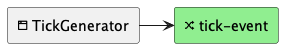
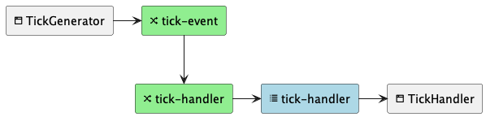
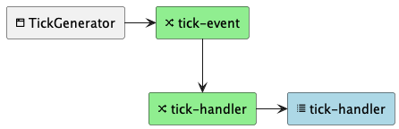
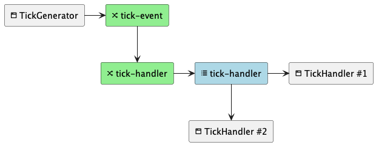
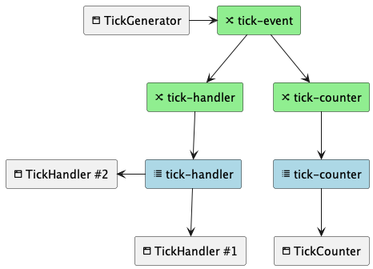
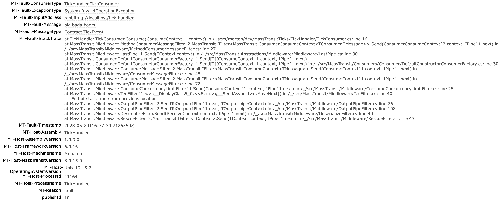
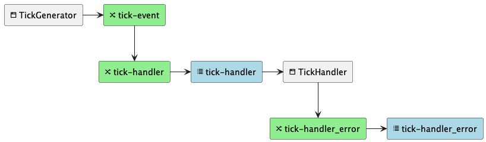
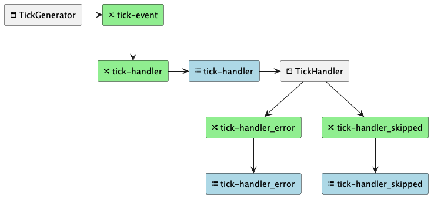

# MassTransitTicks - a demo

This repo contains a few projects meant to demonstrate how the MassTransit
library works in conjunction with RabbitMQ.

## The projects

### TickGenerator

This project is a simple program that will connect to RabbitMQ and **publish**
a `TickEvent` once a second. It does not set up any other topology than the
exchange for the event type. It creates this exchange with an explicit and
custom name (`tick-event`) and demonstrates the part of the protocol that the
producer of event is responsible for. No other exchanges or queues are created
by this project.

### TickHandler

This project is also fairly simple and once started will connect to RabbitMQ and
start listening for the event generated by the TickGenerator application. For
each event consumed it will write a line with the event to the console.

As the listener is the one who knows how an event should be processed it will
configure its own topology in RabbitMQ to make sure it's needs are met and then
bind its exchange and queue to the `tick-event`exchange to copy events from
there.

If the generator was to set this up it would create a coupling between the two
components behavior which we want to avoid in an event driven architecture.

### TickCounter

This project is a copy of TickHandler with one significant change: it connects
to and endpoint called `tick-counter` which is also bound to the `tick-event`
exchange.

This way the two different services will both receive and process the full set
of events, and they are in control of their own routing, retention and
processing rules. No matter how TickHandler handles the event it will not
affect the TickCounter and vice versa.

### Contract

The contract is defined by the TickGenerator and consists of two elements:

1. The event definition - typically a class, record or interface in C#.
2. The name of the exchange where the event is published - in this
   example `tick-event`.

**Note:** The event definition **must** be identical, not just in the class name
but also belong to the same namespace. This is why its mostly convenient to
extract the event into a separate project that can then be shared between the
producer and the consumers.

## Part 1 - Basics

### RabbitMQ

There is a run configuration for launching RabbitMQ in a docker container, if
your IDE supports it use it to launch a container for running the demos.

To launch manually, use the following command from a command prompt:

```shell
docker run -p 15672:15672 -p 5672:5672 masstransit/rabbitmq
```

### TickGenerator

First launch the `TickGenerator`, either through your IDE's launch configuration
or using the dotnet command line.

```shell
dotnet run --project TickGenerator/TickGenerator.csproj
```

You can now go to the
[RabbitMQ web interface](http://localhost:15672/#/exchanges) and verify that
there is a new exchange created called `tick-event`. If this is the first time
running, it should not be bound to anything.
(Log in using **guest** as both username and password.)



*Current state of the system: No one listening*

### TickHandler

The `TickHandler` should be launched next, using the same method as previous.

```shell
dotnet run --project TickHandler/TickHandler.csproj
```

After starting up you should see messages arriving based on the output in the
console.

Going back to the [RabbitMQ web interface](http://localhost:15672/#/exchanges)
there should now be another exchange called `tick-handler` which is bound to
both the exchange called `tick-event`and the new queue called `tick-handler`.

The queue is where the consumer in the application is getting its messages from,
and they are being routed from the broadcast exchange down through the consumer
specific exchange to the queue.

> **Note:**
> The `tick-handler` exchange and queue pair is what in MassTransit is called an
> _endpoint_. Not really that relevant for publishing events, but if you want to
> send commands then you send them directly to an endpoint, which is the
> exchange associated 1-to-1 with the queue.



*Current state of the system: Message routed to one listener process*

## Part 2 - Reliability and availability

### Oh noes!

Lets emulate a service outage of the TickHandler by stopping it. (Ctrl+c in the
console)

If you go to [RabbitMQ](http://localhost:15672/#/queues) now while only the
TickGenerator is running, you should see that all the messages are being
captured in the `tick-handler` queue. As you watch and wait the number of
messages will increase. This is a good thing. It means that the events are still
there waiting for the TickHandler service to be up and running again.



*Current state of the system: Message routed to queue for later processing*

Relaunching the TickHandler will empty that queue rapidly until its empty it
the event processing settles down to the rate of incoming events again.

### Scaling out

So what happens if we start two TickHandlers? Since both instances of the app
is configuring the same topology they will both connect to the same queue and
they will each consume every other event, sharing the load.



*Current state of the system: Message routed to two listeners processes*

### A different listener

Now its time to launch the TickCounter application:

```shell
dotnet run --project TickCounter/TickCounter.csproj
```

This application connects to and sets up an endpoint specifically for itself so
its guaranteed to receive all the events no matter who else is listening. Events
published to `tick-event` is now duplicated into both the `tick-handler` and the
new `tick-counter`exchange.



*Current state of the system: Message routed to multiple processes and client
types*

The two TickHandlers are now sharing in the load to handle the messages, while
the sole TickCounter instance will have to handle all the messages by itself.
There is not anything to prevent you from launching another TickCounter instance
though to share the load for the `tick-counter` queue as well.

### Tick, Tick, Boom!

Lets see what happens if the TickHandler fails to process an event and throws an
exception. Add the following code to the TickConsumer's Consume() method:

```csharp
    public Task Consume(ConsumeContext<TickEvent> context)
    {
        _count++;
        if (Random.Shared.NextInt64(1, 100) > 80)
            throw new InvalidOperationException("big bada boom!");
        Console.WriteLine($"TickConsumer:Consume() [{_count:000} - {DateTime.Now.TimeOfDay}]: {context.Message.Timestamp}");
        return Task.CompletedTask;
    }
```

This will just make it randomly throw an exception which will make MassTransit
reject the message and move it to an error queue. Messages in the error queue
can be inspected and analysed by the developer and they contain a lot of
information, including the callstack for the exception that was thrown and the
original event.



*Example of error information*

The error queue (and exchange) is named the same as the original queue of the
message, postfixed with `_error`. This error queue is what is some times refered
to as a [dead letter queue](https://en.wikipedia.org/wiki/Dead_letter_queue).

The topology and chain of events now looks like this:



*Current state of the system: Event is placed on error queue when the handler
can't process the event*

### Skip queue

Lets say that we change the type of message that our consumer listens for but we
don't update the binding to actually set up the topology for the new message
type in the TickHandler project.

New TickConsumer:

```csharp
namespace TickHandler
{
    public record TickEvent2(string SomeProperty);

    public class TickConsumer : IConsumer<TickEvent2>
    {
        private static int _count;

        public Task Consume(ConsumeContext<TickEvent2> context)
        {
            _count++;
            Console.WriteLine($"TickConsumer:Consume() [{_count:000} - {DateTime.Now.TimeOfDay}]: {context.Message.SomeProperty}");
            return Task.CompletedTask;
        }
    }
}
```

To test this we run `TickGenerator` and the new `TickHandler`.
What happens next is that all the events already waiting in the queue and all
the new incoming messages will be moved to the `tick-handler_skipped` queue.
MassTransit in the `TickHandler` is doing this because the consumer is not set
up to deserialize the message type that is pulled from the queue.

When we stop the `TickHandler` again, events will start to get queued up in the
`tick-handler` queue as normal.



*All the error handling queues*

So in summary, the `_error` queue will contain messages that were of the
expected type, but for some reason threw an exception while being processed.
The `_skipped` queue on the ther hand contains messages that does not match the
message definition in the consumer.
